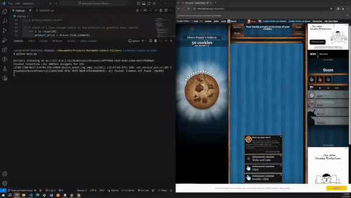

# Automate-Cookie-Clickers

Welcome to the Automate Cookie Clickers repository!

This project showcases my proficiency in web application testing automation using Python and Selenium. The provided script automates the gameplay of a browser-based cookie-clicking game, demonstrating Selenium's capability to interact with web elements seamlessly. By automating repetitive tasks like clicking cookies and purchasing products, this project highlights the power of Selenium in streamlining testing processes and ensuring the robustness of web applications.

## Table of Contents

- [Demo](#demo)
- [Installation](#installation)
- [Usage](#usage)
- [Selenium Script Design](#selenium-script-design)
- [Acknowledgements](#acknowledgements)

## Demo





## Installation

### Intall Selenium

If first time install, run this command:
```bash
pip install selenium
```

### Download chrome driver

https://sites.google.com/chromium.org/driver/

- Under `Latest ChromeDriver Binaries`, go to `the Chrome for Testing availability dashboard`.
- Install the `Stable` version.
- Go to `chromedriver` using `win64` version
- Copy the URL to download the zip and move the zip into the project folder.
- Extract the zip into the project folder.
- Move the `chromedriver.exe` into the root of the project folder. Make sure it's in the same level as the script (in my case, it's `main.py`).
- Delete the remaining installed folders/files.
- Paste the name, `chromedriver.exe`, into the `executable_path`.

## Usage

After installing the chrome driver, use this in the `main.py` to test if the driver works:
```bash

driver.get("https://google.com") # go to google.com

time.sleep(10)  # wait/sleep for 10 sec

driver.quit()  # close the window
```

And run this command:
```bash
python main.py
```


## Selenium Script Design

This Python script utilizes the Selenium WebDriver library to interact with a web browser, specifically Google Chrome, to automate actions on a webpage. Here's a breakdown of how the script works:

1. **WebDriver Initialization**: 
   - The script imports necessary modules from Selenium.
   - It sets up the Chrome WebDriver with the path to the ChromeDriver executable.

2. **Opening the Webpage**:
   - The script directs the WebDriver to open a specific webpage, in this case, "https://orteil.dashnet.org/cookieclicker/".

3. **Waiting for Elements**:
   - The script waits for a specific element, in this case, the "English" language setting, to appear on the webpage using WebDriverWait and expected_conditions.

4. **Interacting with Elements**:
   - Once the "English" language setting appears, it clicks on it to change the language.
   - It locates the main cookie element by its ID and waits for it to appear.
   - After a delay of 10 seconds, it enters a loop to continuously click the cookie element.

5. **Automated Actions**:
   - Within the loop, the script extracts the current number of cookies generated.
   - It iterates through a range of products, checking if the user has enough cookies to purchase each product.
   - If enough cookies are available, it buys the product and continues clicking the main cookie element.


## Acknowledgements

- Inspired by [Tech With Tim](https://www.youtube.com/watch?v=NB8OceGZGjA&ab_channel=TechWithTim)

Feel free to reach out with any questions or feedback!